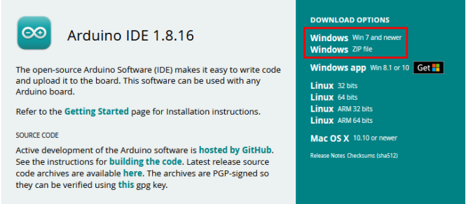

# Get started with Arduino

## 1. Windows System：           

### 1.1 Installing Arduino IDE
When you get control board, you need to download Arduino IDE and driver firstly.
You could download Arduino IDE from the official website:
https://www.arduino.cc/, click the SOFTWARE on the browse bar, click“DOWNLOADS” to enter download page, as shown below:

There are various versions of IDE for Arduino. Just download a version compatible with your system. Here we will show you how to download and install the windows version of Arduino IDE.

There are two versions of IDE for WINDOWS system. You can choose between the installer (.exe) and the Zip file. For installer, it can be directly downloaded, without the need of installing it manually while for Zip package, you will need to install the driver manually.

You just need to click JUST DOWNLOAD.

After the Arduino is downloaded, click“**I Agree**”to continue installing。

Click “**Next**”。

Then click “**Install**”。

If the following page appears, click “Install”。

### 1.2. Install the driver of CH340：
If the driver of CH340 is installed, just skip following steps.
If your system is Windows 10 or MacOS, the computer will automatically install driver.

If not，you need to install driver manually.

Connect the control board to computer with a USB cable.

Click “**Computer**”----- “**Properties**”----- “**Device Manager**”, as shown below:

Then right-click on the device and select the top menu option (**Update Driver Software...**) shown as the figure below.

Then it will be prompted to either“**Search Automatically forupdated driversoftware**” or“**Browse my computer for driver software**”. Shown as below. In this page, select “**Browse my computer for driver software**”.

After that, select the option to browse and navigate to the “drivers” folder (**usb_ch341_3.1.2009.06 folder**) of usb-ch341 installation.

Then check the serial port, as shown below：

### 1.3. Arduino IDE Setting：

A- Used to verify whether there is any compiling mistakes or not.
B- Used to upload the sketch to your Arduino board.
C- Used to create shortcut window of a new sketch.
D- Used to directly open an example sketch.
E- Used to save the sketch.
F- Used to send the serial data received from board to the serial monitor.

### 1.4. Start your program:
Click“File”<“Examples”<“Basics” <“Blink”

Select the correct board and serial port.

Click  to upload the script

Then you can see the LED on the board flash.

## 2. Mac System:

### 2.1 Install Arduino IDE on MAC System

The installation instruction is as same as the chapter 1.1, as shown below:

### 2.2 Download the CH340 driver

https://fs.keyestudio.com/CH340-MAC

### 2.3 How to install the CH340 driver

Please refer to the following link:
https://wiki.keyestudio.com/Download_CH340_Driver_on_MAC_System

### 2.4 Setting Arduino IDE

The setting method is as same as the chapter 1.4 except from COM port, as shown below:

## 3. Burn the firmware of the writing machine

Import the libraries of the machine to the Arduino, as shown below:

Enter the Arduino: Sketch > Include Library > Add .ZIP Library 。

Find out the file package we provide and open it, as shown below：

Until this step, the installation is finished

Open the firmware code and program

