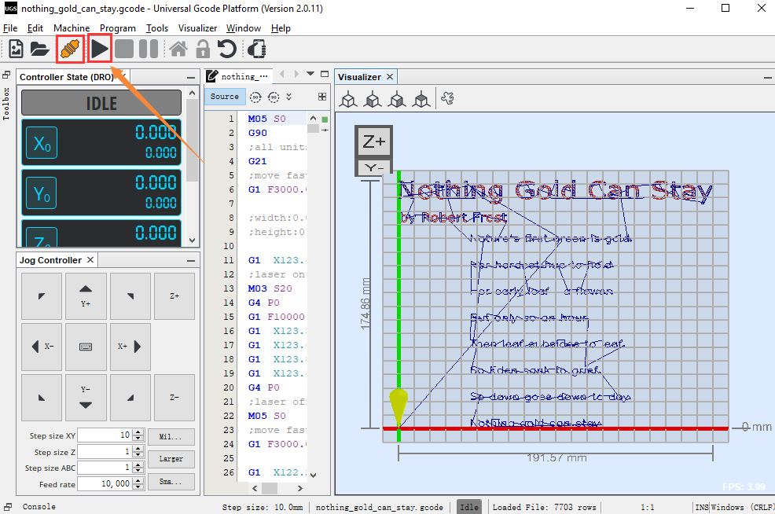

# KS0552  Keyestudio Writing Machine for Arduino DIY

This is a CoreXY writing machine. It is compatible with distinct styles fonts
like hollow font, filled font and monoline fonts. A customized special signature
is not a dreamy reverie for you. In addition, it can draw and outline sleek and
beautiful lines. With this amazing machine, you can create art works yourself.

##  **Features**

  coreXY parallel motion

  Simple and stable structure

  Highly precise rail is used, well-performed writing and drawing

  Simple control software

##  **Parameters**

Power supply

| Voltage | 12V |
|---------|-----|
| Current | 5A  |
| Power   | 60W |

## **Control Board**

Control Chip：Mega328P

Input Voltage： 12V

Dimension： 297 \* 210

## **How to assemble**

Refer to the file we provide

## 3.1 Install Arduino IDE and burn firmware

Browse the file 

Install Inkscape and Gcode

Inkscape aims at generating Gcode that can be identified by the machine

They are included in the folder we provide, as shown below;

Double-click inkscape-1.1.2_2022-02-05_b8e25be833-x64.msi to install and you
will see  on the desktop

1.  Add extension package

Double-click Inkscape and click **Time to Draw** then **New Docunment**

Copy all files of the extension package inkscape_extension

Click **Edit** and **Preferences**

Click **System** and open **User extensions**

Then all files of the extension package to the following directory

Check if the extension package is well installed

Turn off inkscape and reboot it

Click **Extensions**，then you will view keyestudio drawing and KM-LASER. That
means successful installation.

## 3.2 Install Universal Gcode Sender

Universal Gcode Sender is designed to enable the movement of the machine through
hand and command control as well as send **Gcode**

You can download installation
package：http://winder.github.io/ugs_website/download/

Also, we provide it in the folder.

Unzip software package

Copy ugs-platform-app-win.zi to D:\\Program Files

Open the software

Open the bin folder from the unzipped folder.

D:\\Program Files\\ugs-platform-app-win\\ugsplatform-win\\bin

If your computer is 64-bit, double-click ugsplatform64.exe

Click ugsplatform64.exe then right-click Create shortcut to generate a shortcut
key, as shown below;

Then copy it to your desktop.

## 4.Modify firmware parameters

### 4.1 Wire up a power supply with USB cables

### 4.2 Connect the machine to the Universal Gcode Sender

Wire up in accordance to the following figure

The LED on the control board will flash after the board is well connected. And
Universal Gcode Sender will show as follows;

### 4.3 Control the machine to move

Power up, keep moving parts not too close in that collision will occur during
movement.

Set steps of X and Y axis，click direction keys. Normally，the machine will move
at X and Y axis.

Step size XY stands for movement distance while clicking a key

Feed rate is speed

### 4.4 Set motion parameter

| steps of rotation | 200 |
|-------------------|-----|
| belt pulley       | 20  |
| GT2 belt          | 2mm |

Through calculation, 80 steps is needed when the x and y axis of the machine
moves 1mm, the following formula is shown below:

x_steps_per_mm = y_steps_per_mm =

**Parameters description in the formula**

Steps = Steps of the stepper motor(the step of the 1.8 degree motor is 200)

Microstepping = driver configuration of the stepper motor (RAMPS is default as
1/16 etc.)

BeltPitch = teeth pitch of synchronous belt (T5 is 5.00mm , XL is 5.08mm , GT2
is 2.0mm etc.)

We use GT2

PulleyTeeth =2o tooth

**Finally, substitute the parameters into the formula**

x_steps_per_mm = y_steps_per_mm =200\*16 / (2\*20) = 80

Parameter \$100 and \$101.

We decide how many steps the machine move 1 mm.

need to set \$100=80, \$101=80

If above two parameters differ from real parameters of the machine, the size of
newly produced pictures will be not as same as the defined pictures

### **4.5 Setting method**

Click **Console**，a command box will appear, as shown below;

Input \$\$ and click **Enter**，then you can click all parameters of the
firmware

Set \$100=80, \$101=80 ，then you need to input \$100=80 + Enter and \$101=80 +
Enter

### 4.6 Adjust the distance between the writing head and the paper

Control command

| Write        | M3 S50 (0\~90correspond to the rotation angle of 0\~180） |
|--------------|-----------------------------------------------------------|
| Hold the pen | M5 S0                                                     |

Put an A4 paper under the machine

Send a command to control the pen holder

Power up, connect USB cables

Lift the pen holder，M5 S0 + Enter

Lower the pen holder，M3 S50 + Enter，fix the pen on the holder and make the
writing head touch the paper.

At this step, the pen holder is well adjusted.

### 4.7 Adjust speed to write and draw

Set parameters of the machine to \$110 and \$111 and acceleration value to \$120
and \$121.

Input \$\$ in the Command to check the configuration parameter and view \$110,
\$111, \$120 and \$121

We turn \$110 and \$111into 500，\$120 and 121 are equal to 10

We turn \$110 and \$111 into 5000，\$120 and 121 are turned into 200

在Command中，input：\$110 = 5000 + Enter，\$111 = 5000 + Enter；

\$120 = 200 + Enter，\$121 = 200 + Enter

Input \$\$

You can adjust speed values if you think speed is too fast or slow.

## 5.Generate pictures into Gcode through Inkscape

Roughly all pictures can be identified and generated into contour pictures
through Inkscape, then transformed into Gcode through an extension tool

### 5.1 Generate pictures into Gcode

We provide example pictures in the file. However, you can choose pictures you
like.

Open Inkscape. Click A4 and landscape

### **5.2 Open example pictures**

You only need to drag example pictures to the interface of the software

### **5.3 Generate outline picture**

1.  Click Path \> Trace Bitmap \> Update，then generate Bitmap pictures，as
    shown below;

Drag the generated picture aside then delete the original one

Adjust the size and location of bitmap picture and keep it in the paper.

1.  Produce Gcode

Adjust speed of x and y axis and how much the pen holder can lower down. Save
the path of Gcode and name, then click Apply.

Click OK

Open the path you saved then a new Gcode file is produced

 Control the machine to draw via Universal Gcode Sender

We transform the picture gear 2 into gear2.gcode then send gear2.gcode to the
pen plotter to draw gears.

Open Universal Gcode Sender

Click File \> Open

Save the path of the gcode and open gear2.gcode

**Connect and draw**

Move the X and Y axis at the start point, leave an A4 paper under the machine
and keep them aligned, as shown below

Follow the instruction to operate

Normally, the pen plotter will start drawing the gear

#### Turn fonts into Gcode through Inkscape

This is a poem named Nothing Gold Can Stay

The headline is filled font, the author name is not filled and the poem is
monoline font. That indicates gcode is completed through three methods

##### 7.1 Write a poem through inkscape

Adjust the size of fonts, as shown below

##### 7.2 Deal with filled fonts

The headline is filled

Select the headline and click Path \> Object to path

Then click the headline again and click Extension \> KM-LASER \> FILL:HATCH FILL

Then a page appears and keep parameter unchanged and click Apply

Now, you will find the font of the headline change

##### 7.3 Hollow Fonts

The name of author is set to hollow fonts

Select the name and click Path \> Object to Path

##### 7.4 Mongline fonts

Follow the instruction as below:

##### 7.5 Transform fonts into Gcode

Click keyestudio drawing \> Gcode Generator to generate gcode.

Remember to modify the name of Gcode

#### 7.6 Control the machine to write through Universal Gcode Sender

Move the X and Y axis at the start point, leave an A4 paper under the machine
and keep them aligned, as shown below

Open the above generated Gcode through Gcode Sender

Connect and click start. Then a poem Nothing Gold Can Stay will be shown

