| Step 1                                                                                                                                      |                                                                                                  |
|---------------------------------------------------------------------------------------------------------------------------------------------|--------------------------------------------------------------------------------------------------|
|  Components Required                                                                                                                        | 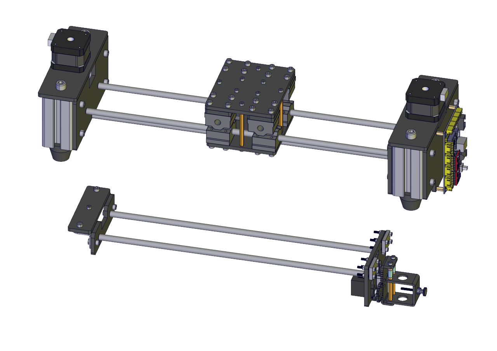                                                  |
|  Dismantle two screws 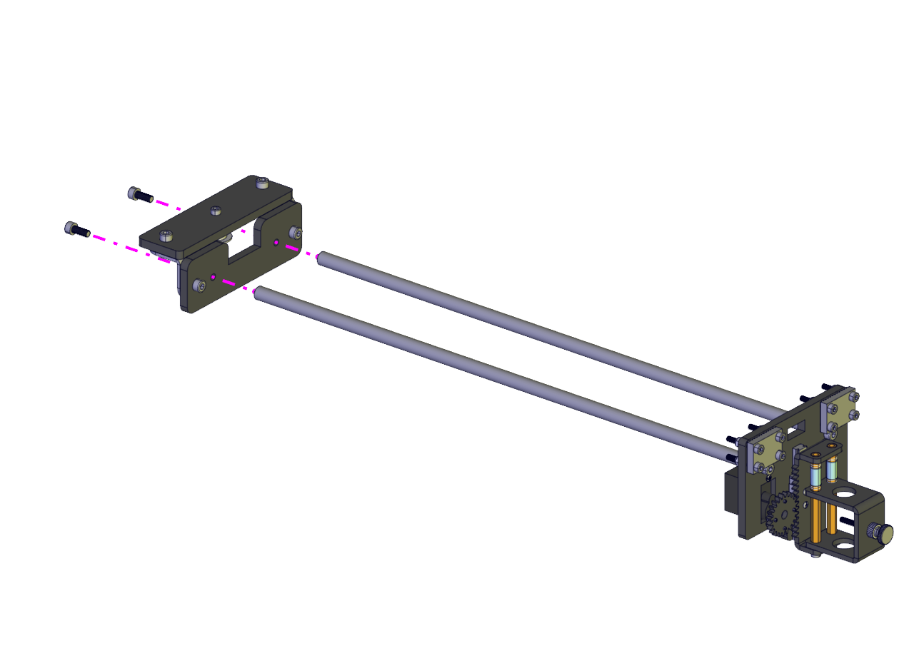 As shown below:        |                                                                                                  |
|  Insert polish rods into the bearing 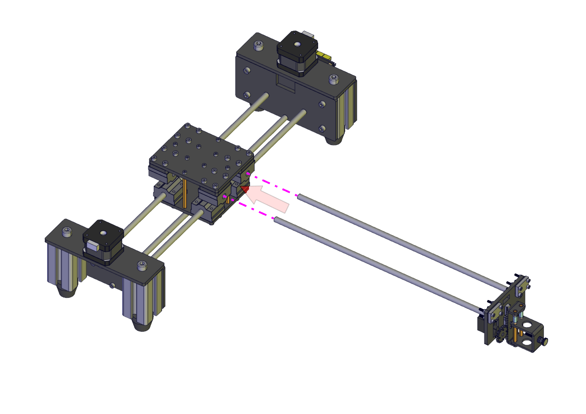         |                                                                                                  |
| Assemble the dismantled component again      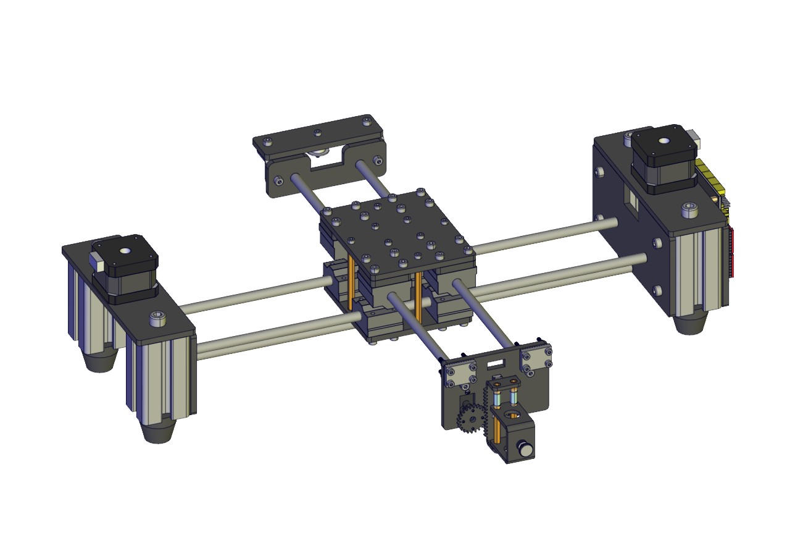 |                                                                                                  |
| Synchronous Belt                                                                                                                            |                                                                                                  |
| GT2                                                                                          |                                                                                                  |
|   Loosen two clap plates                                                                                                                    | 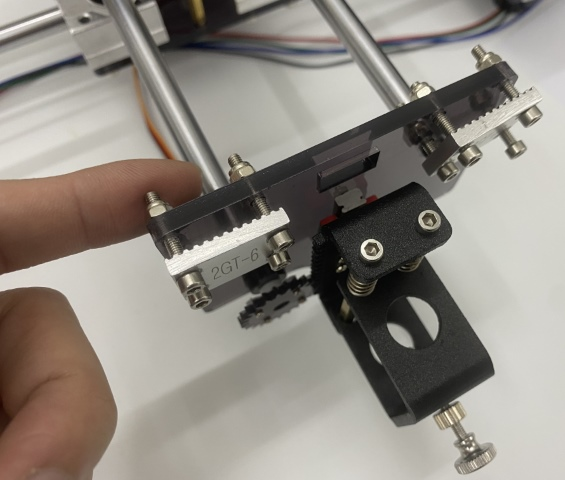                                                 |
|  Make a synchronous belt go through the right clap plate and fix them together                                                              | 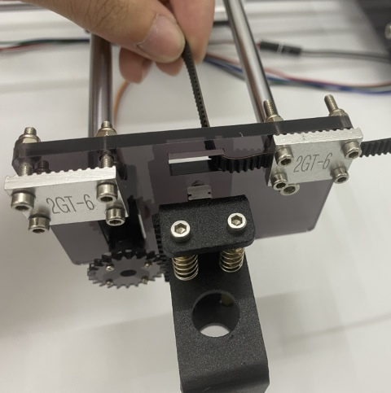                                                 |
|   Then make it go through the synchronous wheel                                                                                             | 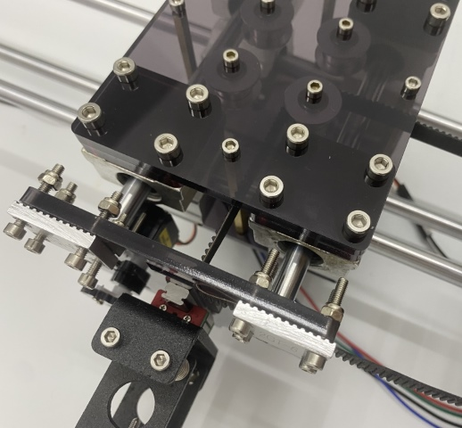                                                 |
| Hang the synchronous belt on the synchronous wheel of right motor                                                                           | 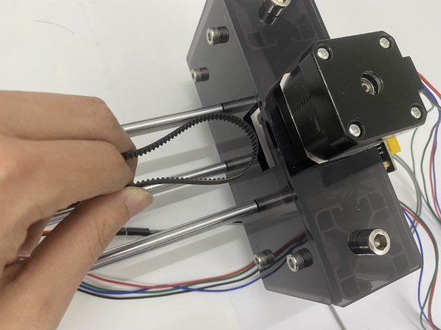 |
|   Then make the belt clamber onto the right wheel(as shown in the graph)                                                                    | 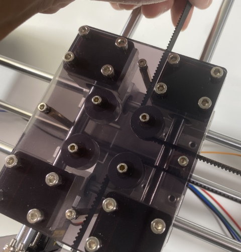                                                 |
|  Then hang on the upper one (as shown in the graph)                                                                                         | 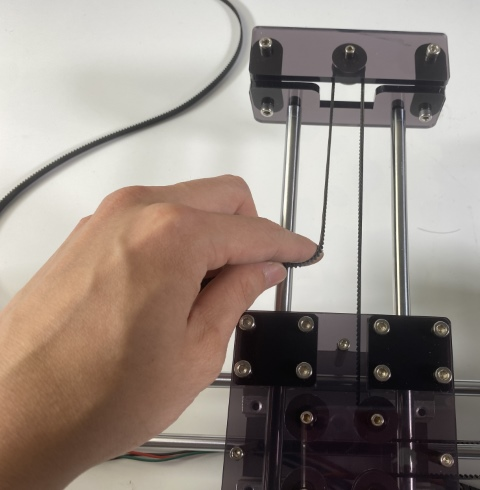                                                 |
|     Then clamber on the left one                                                                                                            | 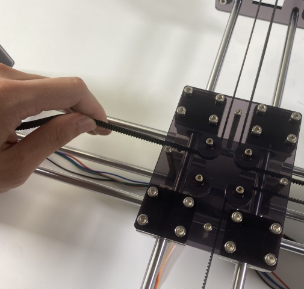                                                 |
|    Go through the left driving wheel of the left motor                                                                                      | 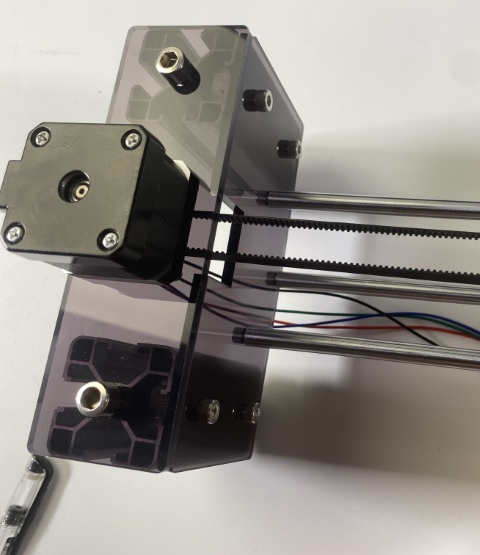                                                 |
|   Next, pass through the lower left synchronization wheel                                                                                   | 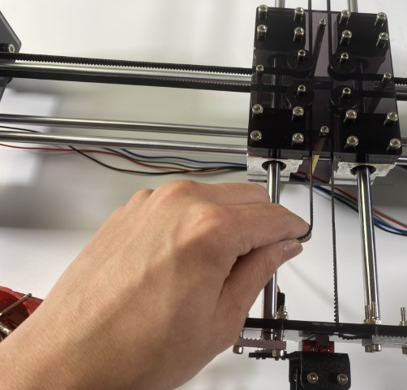                                                 |
|  At last, pass through the clap plate with the the other end of synchronous belt and lock it tightly                                        | 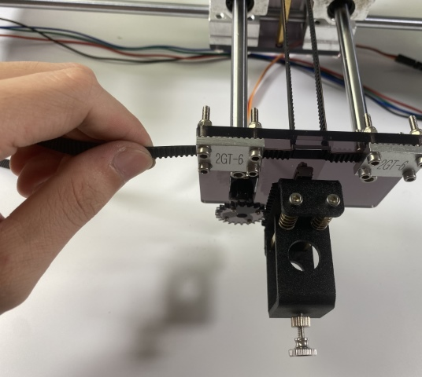                                                 |
| Wiring up                                                                                                                                   |                                                                                                  |
|        Left motor                                                                                                                           | 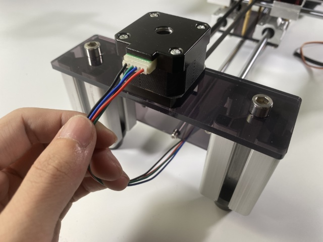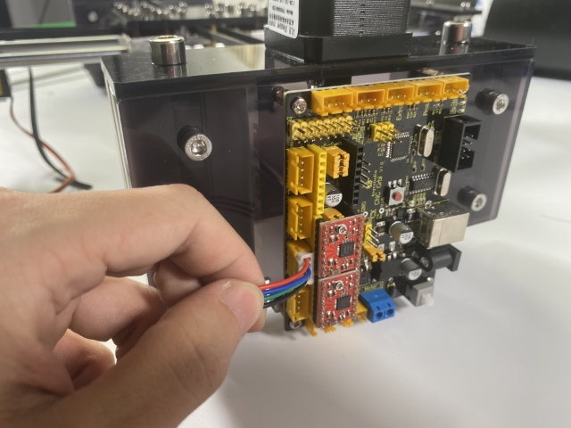 |
|         Wire up the left motor                                                                                                              | 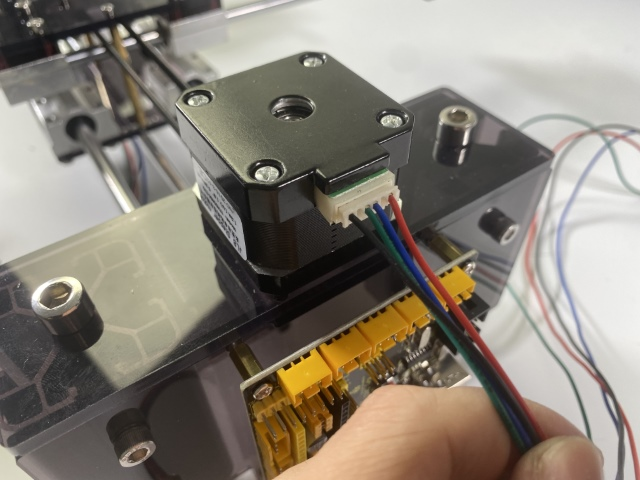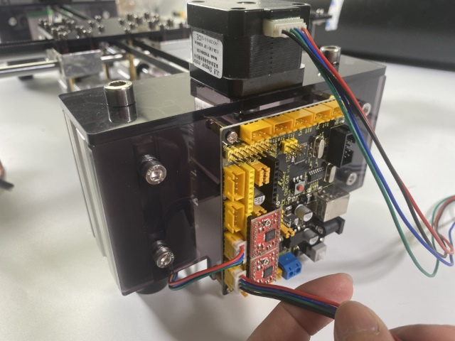 |
|      You need to interface the servo with the control board using extension Dupont wires                                                    | 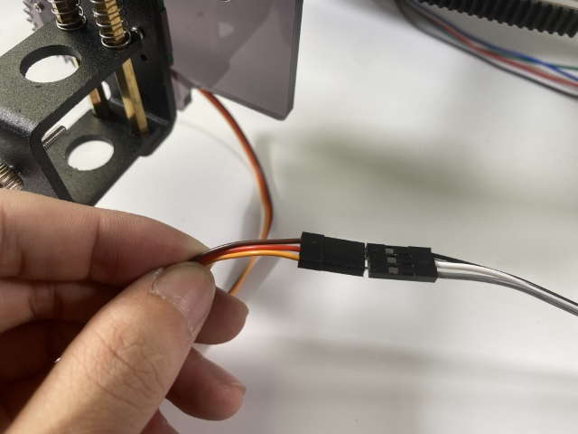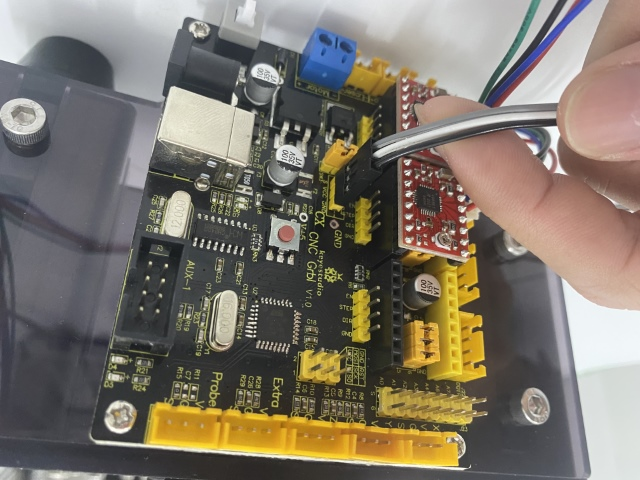 |
| Adjust the servo to initial angle                                                                                                           |                                                                                                  |
|    Pull the pen holder out                                                                                                                  | 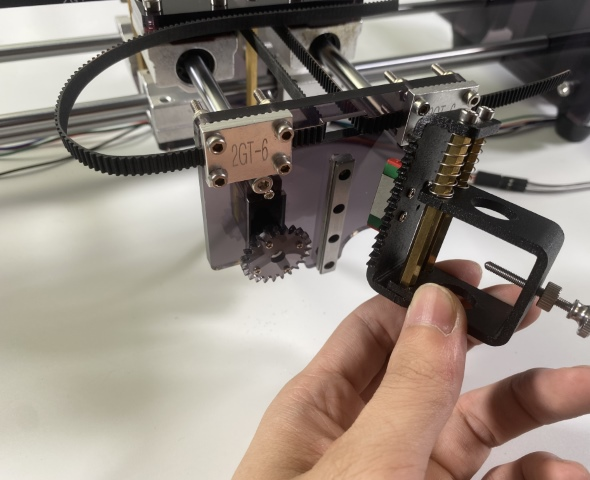                                                 |
|  Rotate the servo anticlockwise until it stuck(the state that rotation is restricted)                                                       | 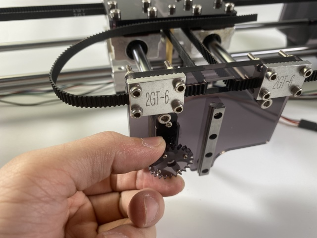                                                 |
|   Then fix the pen holder onto the sliding trail                                                                                            | 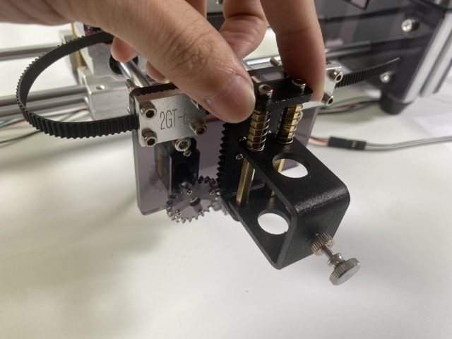                                                 |
| Hold a pen                                                                                                                                  |                                                                                                  |
|   Rotate the knob anticlockwise                                                                                                             | 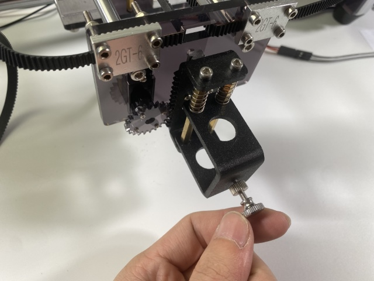                                                 |
|     Put a pen and adjust it at a proper height. Then lock it tightly                                                                        | 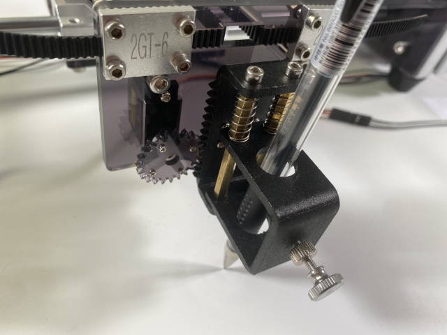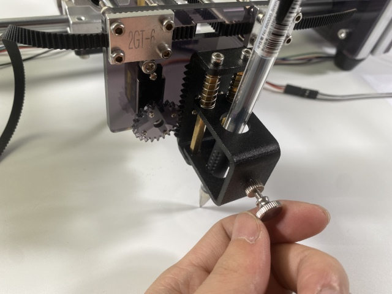 |

